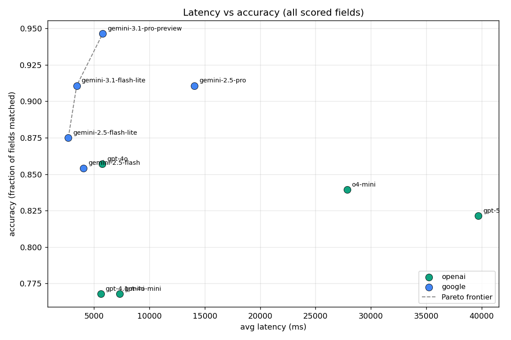
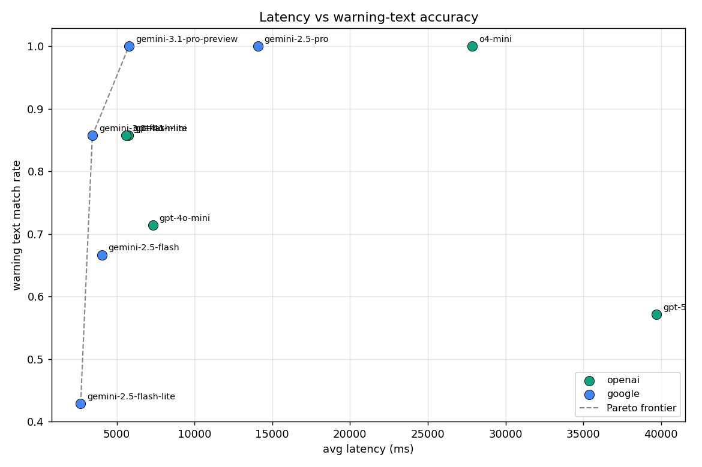

# Extraction benchmark

_7 bottles × 10 models_

## Latency vs accuracy





## Aggregate scores

| model | accuracy | warn text | warn style | avg latency | avg tokens (in/out) | confidence | errors |
|---|---|---|---|---|---|---|---|
| gpt-4o-mini | 43/56 (77%) | 5/7 (71%) | 5/7 (71%) | 7310ms | 39069/242 | hi 56 / med 0 / low 0 | 0 |
| gpt-4o | 48/56 (86%) | 6/7 (86%) | 5/7 (71%) | 5748ms | 3226/254 | hi 53 / med 0 / low 3 | 0 |
| gpt-4.1-mini | 43/56 (77%) | 6/7 (86%) | 6/7 (86%) | 5610ms | 4720/274 | hi 47 / med 2 / low 7 | 0 |
| o4-mini | 47/56 (84%) | 7/7 (100%) | 4/7 (57%) | 27859ms | 4872/2537 | hi 49 / med 5 / low 2 | 0 |
| gpt-5 | 46/56 (82%) | 4/7 (57%) | 4/7 (57%) | 39716ms | 3139/3004 | hi 30 / med 16 / low 10 | 0 |
| gemini-2.5-flash-lite | 49/56 (88%) | 3/7 (43%) | 0/7 (0%) | 2675ms | 2455/378 | hi 52 / med 0 / low 4 | 0 |
| gemini-2.5-flash | 41/48 (85%) | 4/6 (67%) | 2/6 (33%) | 4045ms | 2455/385 | hi 40 / med 1 / low 7 | 1 |
| gemini-2.5-pro | 51/56 (91%) | 7/7 (100%) | 3/7 (43%) | 14073ms | 2455/1444 | hi 55 / med 1 / low 0 | 0 |
| gemini-3.1-flash-lite | 51/56 (91%) | 6/7 (86%) | 6/7 (86%) | 3430ms | 2844/374 | hi 56 / med 0 / low 0 | 0 |
| gemini-3.1-pro-preview | 53/56 (95%) | 7/7 (100%) | 4/7 (57%) | 5783ms | 1729/364 | hi 47 / med 5 / low 4 | 0 |

## don_julio

**Ground truth:**

```json
{
  "brand": "Don Julio",
  "class_type": "Tequila Blanco",
  "alcohol_content": 40.0,
  "net_contents": "750 mL",
  "producer_name": "Diageo",
  "producer_address": "New York, NY",
  "is_imported": true,
  "country_of_origin": "Mexico"
}
```

| model | brand | class_type | alcohol_content | net_contents | producer_name | producer_address | is_imported | country_of_origin | warn text | warn style | score | confidence | latency |
|---|---|---|---|---|---|---|---|---|---|---|---|---|---|
| gpt-4o-mini | ✓ `Don Julio`<br><sub>exact match after normalize</sub> | ✗ `Tequila`<br><sub>below fuzzy threshold (66.7 < 85.0)</sub> | ✓ `40% alc./vol.`<br><sub>within ±0.1% tolerance (Δ 0.00)</sub> | ✓ `750 ml`<br><sub>equal after unit conversion (750 mL vs 750 mL)</sub> | ✓ `DIAGEO`<br><sub>exact match after producer-role normalize</sub> | ✓ `NEW YORK, NY`<br><sub>exact match after state/country normalize</sub> | ✓ `True`<br><sub>exact match</sub> | ✓ `PRODUCT OF MEXICO`<br><sub>exact match after country normalize</sub> | ✗<br><sub>text differs from TTB canonical warning</sub> | ✗<br><sub>style not evaluated because warning text differs</sub> | 7/8 | hi 8 / med 0 / low 0 | 5601ms |
| gpt-4o | ✓ `Don Julio`<br><sub>exact match after normalize</sub> | ✓ `Tequila Blanco`<br><sub>exact match after class normalize</sub> | ✓ `40% alc./vol.`<br><sub>within ±0.1% tolerance (Δ 0.00)</sub> | ✓ `750 ml`<br><sub>equal after unit conversion (750 mL vs 750 mL)</sub> | ✗ `Imported by Diageo, New York, `<br><sub>below fuzzy threshold (50.0 < 85.0)</sub> | ✓ `New York, NY`<br><sub>exact match after state/country normalize</sub> | ✓ `True`<br><sub>exact match</sub> | ✓ `Product of Mexico`<br><sub>exact match after country normalize</sub> | ✓<br><sub>exact text match to TTB canonical</sub> | ✗<br><sub>text matches but warning header is not bold</sub> | 7/8 | hi 8 / med 0 / low 0 | 4018ms |
| gpt-4.1-mini | ✓ `Don Julio`<br><sub>exact match after normalize</sub> | ✓ `TEQUILA BLANCO`<br><sub>exact match after class normalize</sub> | ✓ `40% alc./vol.`<br><sub>within ±0.1% tolerance (Δ 0.00)</sub> | ✓ `750 mL`<br><sub>equal after unit conversion (750 mL vs 750 mL)</sub> | ✗ `IMPORTED BY DIAGEO, NEW YORK, `<br><sub>below fuzzy threshold (50.0 < 85.0)</sub> | ✓ `NEW YORK, NY`<br><sub>exact match after state/country normalize</sub> | ✓ `True`<br><sub>exact match</sub> | ✓ `PRODUCT OF MEXICO`<br><sub>exact match after country normalize</sub> | ✓<br><sub>exact text match to TTB canonical</sub> | ✓<br><sub>warning typography review (bold confirmed; body regular)</sub> | 7/8 | hi 8 / med 0 / low 0 | 8495ms |
| o4-mini | ✓ `Don Julio™`<br><sub>fuzzy match (94.7)</sub> | ✓ `TEQUILA BLANCO`<br><sub>exact match after class normalize</sub> | ✓ `40% alc./vol.`<br><sub>within ±0.1% tolerance (Δ 0.00)</sub> | ✓ `750 mL`<br><sub>equal after unit conversion (750 mL vs 750 mL)</sub> | ✓ `DIAGEO`<br><sub>exact match after producer-role normalize</sub> | ✓ `NEW YORK, NY`<br><sub>exact match after state/country normalize</sub> | ✓ `True`<br><sub>exact match</sub> | ✓ `PRODUCT OF MEXICO`<br><sub>exact match after country normalize</sub> | ✓<br><sub>exact text match to TTB canonical</sub> | ✗<br><sub>text matches but warning header is not bold</sub> | 8/8 | hi 8 / med 0 / low 0 | 29418ms |
| gpt-5 | ✓ `Don Julio™`<br><sub>fuzzy match (94.7)</sub> | ✓ `TEQUILA BLANCO`<br><sub>exact match after class normalize</sub> | ✓ `40% alc./vol.`<br><sub>within ±0.1% tolerance (Δ 0.00)</sub> | ✓ `750 mL`<br><sub>equal after unit conversion (750 mL vs 750 mL)</sub> | ✓ `IMPORTED BY DIAGEO`<br><sub>exact match after producer-role normalize</sub> | ✓ `NEW YORK, NY`<br><sub>exact match after state/country normalize</sub> | ✓ `True`<br><sub>exact match</sub> | ✓ `PRODUCT OF MEXICO`<br><sub>exact match after country normalize</sub> | ✓<br><sub>exact text match to TTB canonical</sub> | ✓<br><sub>warning typography review (bold confirmed; body regular)</sub> | 8/8 | hi 7 / med 1 / low 0 | 35869ms |
| gemini-2.5-flash-lite | ✓ `Don Julio`<br><sub>exact match after normalize</sub> | ✓ `TEQUILA BLANCO`<br><sub>exact match after class normalize</sub> | ✓ `40% alc./vol.`<br><sub>within ±0.1% tolerance (Δ 0.00)</sub> | ✓ `750 ml`<br><sub>equal after unit conversion (750 mL vs 750 mL)</sub> | ✗ `IMPORTED BY DIAGEO, NEW YORK, `<br><sub>below fuzzy threshold (50.0 < 85.0)</sub> | ✓ `NEW YORK, NY`<br><sub>exact match after state/country normalize</sub> | ✓ `True`<br><sub>exact match</sub> | ✓ `PRODUCT OF MEXICO`<br><sub>exact match after country normalize</sub> | ✓<br><sub>exact text match to TTB canonical</sub> | ✗<br><sub>text matches but warning header is not bold</sub> | 7/8 | hi 8 / med 0 / low 0 | 2588ms |
| gemini-2.5-flash | ✓ `Don Julio`<br><sub>exact match after normalize</sub> | ✓ `TEQUILA BLANCO`<br><sub>exact match after class normalize</sub> | ✓ `40% alc./vol.`<br><sub>within ±0.1% tolerance (Δ 0.00)</sub> | ✓ `750 ml`<br><sub>equal after unit conversion (750 mL vs 750 mL)</sub> | ✓ `DIAGEO`<br><sub>exact match after producer-role normalize</sub> | ✓ `NEW YORK, NY`<br><sub>exact match after state/country normalize</sub> | ✓ `True`<br><sub>exact match</sub> | ✓ `PRODUCT OF MEXICO`<br><sub>exact match after country normalize</sub> | ✓<br><sub>exact text match to TTB canonical</sub> | ✓<br><sub>warning typography review (bold confirmed; body regular)</sub> | 8/8 | hi 8 / med 0 / low 0 | 2927ms |
| gemini-2.5-pro | ✓ `Don Julio`<br><sub>exact match after normalize</sub> | ✓ `TEQUILA BLANCO`<br><sub>exact match after class normalize</sub> | ✓ `40% alc./vol.`<br><sub>within ±0.1% tolerance (Δ 0.00)</sub> | ✓ `750 ml`<br><sub>equal after unit conversion (750 mL vs 750 mL)</sub> | ✓ `IMPORTED BY DIAGEO`<br><sub>exact match after producer-role normalize</sub> | ✓ `NEW YORK, NY`<br><sub>exact match after state/country normalize</sub> | ✓ `True`<br><sub>exact match</sub> | ✓ `PRODUCT OF MEXICO`<br><sub>exact match after country normalize</sub> | ✓<br><sub>exact text match to TTB canonical</sub> | ✗<br><sub>text matches but warning header is not bold</sub> | 8/8 | hi 8 / med 0 / low 0 | 11772ms |
| gemini-3.1-flash-lite | ✓ `Don Julio`<br><sub>exact match after normalize</sub> | ✓ `TEQUILA BLANCO`<br><sub>exact match after class normalize</sub> | ✓ `40% alc./vol.`<br><sub>within ±0.1% tolerance (Δ 0.00)</sub> | ✓ `750 ml`<br><sub>equal after unit conversion (750 mL vs 750 mL)</sub> | ✓ `IMPORTED BY DIAGEO`<br><sub>exact match after producer-role normalize</sub> | ✓ `NEW YORK, NY`<br><sub>exact match after state/country normalize</sub> | ✓ `True`<br><sub>exact match</sub> | ✓ `PRODUCT OF MEXICO`<br><sub>exact match after country normalize</sub> | ✓<br><sub>exact text match to TTB canonical</sub> | ✓<br><sub>warning typography review (bold confirmed; body regular)</sub> | 8/8 | hi 8 / med 0 / low 0 | 3219ms |
| gemini-3.1-pro-preview | ✓ `Don Julio`<br><sub>exact match after normalize</sub> | ✓ `TEQUILA BLANCO`<br><sub>exact match after class normalize</sub> | ✓ `40% alc./vol.`<br><sub>within ±0.1% tolerance (Δ 0.00)</sub> | ✓ `750 mL`<br><sub>equal after unit conversion (750 mL vs 750 mL)</sub> | ✓ `DIAGEO`<br><sub>exact match after producer-role normalize</sub> | ✓ `NEW YORK, NY`<br><sub>exact match after state/country normalize</sub> | ✓ `True`<br><sub>exact match</sub> | ✓ `PRODUCT OF MEXICO`<br><sub>exact match after country normalize</sub> | ✓<br><sub>exact text match to TTB canonical</sub> | ✓<br><sub>warning typography review (bold confirmed; body regular)</sub> | 8/8 | hi 8 / med 0 / low 0 | 7022ms |

---

## gray_whale

**Ground truth:**

```json
{
  "brand": "Gray Whale Gin",
  "class_type": "Gin",
  "alcohol_content": 43.0,
  "net_contents": "750 mL",
  "producer_name": "Golden State Distillery",
  "producer_address": "Parlier, California",
  "is_imported": false,
  "country_of_origin": null
}
```

| model | brand | class_type | alcohol_content | net_contents | producer_name | producer_address | is_imported | country_of_origin | warn text | warn style | score | confidence | latency |
|---|---|---|---|---|---|---|---|---|---|---|---|---|---|
| gpt-4o-mini | ✗ `GRAY WHALE`<br><sub>below fuzzy threshold (83.3 < 85.0)</sub> | ✓ `GIN`<br><sub>exact match after class normalize</sub> | ✓ `43% ALC./VOL.`<br><sub>within ±0.1% tolerance (Δ 0.00)</sub> | ✓ `750ML`<br><sub>equal after unit conversion (750 mL vs 750 mL)</sub> | ✓ `GOLDEN STATE DISTILLERY`<br><sub>exact match after producer-role normalize</sub> | ✓ `PARADISE, CALIFORNIA`<br><sub>fuzzy match (86.5) after state/country normalize</sub> | ✓ `False`<br><sub>exact match</sub> | ✓ `Product of California`<br><sub>extracted country tolerated on domestic bottle</sub> | ✓<br><sub>exact text match to TTB canonical</sub> | ✓<br><sub>warning typography review (bold confirmed; body regular)</sub> | 7/8 | hi 8 / med 0 / low 0 | 8918ms |
| gpt-4o | ✗ `GRAY WHALE`<br><sub>below fuzzy threshold (83.3 < 85.0)</sub> | ✓ `GIN`<br><sub>exact match after class normalize</sub> | ✓ `43% ALC./VOL.`<br><sub>within ±0.1% tolerance (Δ 0.00)</sub> | ✓ `750 ML`<br><sub>equal after unit conversion (750 mL vs 750 mL)</sub> | ✗ `DISTILLED & BOTTLED BY GOLDEN `<br><sub>below fuzzy threshold (62.5 < 85.0)</sub> | ✗ `null`<br><sub>missing value on one side</sub> | ✓ `False`<br><sub>exact match</sub> | ✓ `null`<br><sub>both null (domestic)</sub> | ✓<br><sub>exact text match to TTB canonical</sub> | ✓<br><sub>warning typography review (bold confirmed; body regular)</sub> | 5/8 | hi 6 / med 0 / low 2 | 7354ms |
| gpt-4.1-mini | ✗ `GRAY WHALE`<br><sub>below fuzzy threshold (83.3 < 85.0)</sub> | ✓ `GIN`<br><sub>exact match after class normalize</sub> | ✓ `43% ALC./VOL. 750ML`<br><sub>within ±0.1% tolerance (Δ 0.00)</sub> | ✓ `43% ALC./VOL. 750ML`<br><sub>equal after unit conversion (750 mL vs 750 mL)</sub> | ✗ `DISTILLED & BOTTLED BY GOLDEN `<br><sub>below fuzzy threshold (70.8 < 85.0)</sub> | ✗ `null`<br><sub>missing value on one side</sub> | ✓ `False`<br><sub>exact match</sub> | ✓ `null`<br><sub>both null (domestic)</sub> | ✗<br><sub>text differs from TTB canonical warning</sub> | ✗<br><sub>style not evaluated because warning text differs</sub> | 5/8 | hi 6 / med 0 / low 2 | 5357ms |
| o4-mini | ✗ `GRAY WHALE`<br><sub>below fuzzy threshold (83.3 < 85.0)</sub> | ✓ `GIN`<br><sub>exact match after class normalize</sub> | ✓ `43% ALC./VOL.`<br><sub>within ±0.1% tolerance (Δ 0.00)</sub> | ✓ `750ML`<br><sub>equal after unit conversion (750 mL vs 750 mL)</sub> | ✓ `DISTILLED & BOTTLED BY GOLDEN `<br><sub>exact match after producer-role normalize</sub> | ✓ `Parlier, California`<br><sub>exact match after state/country normalize</sub> | ✓ `False`<br><sub>exact match</sub> | ✓ `null`<br><sub>both null (domestic)</sub> | ✓<br><sub>exact text match to TTB canonical</sub> | ✗<br><sub>text matches but warning header is not bold</sub> | 7/8 | hi 4 / med 3 / low 1 | 34548ms |
| gpt-5 | ✗ `GRAY WHALE`<br><sub>below fuzzy threshold (83.3 < 85.0)</sub> | ✓ `GIN`<br><sub>exact match after class normalize</sub> | ✓ `43% ALC./VOL.`<br><sub>within ±0.1% tolerance (Δ 0.00)</sub> | ✓ `750ML`<br><sub>equal after unit conversion (750 mL vs 750 mL)</sub> | ✓ `DISTILLED & BOTTLED BY GOLDEN `<br><sub>exact match after producer-role normalize</sub> | ✓ `PARLIER, CALIFORNIA`<br><sub>exact match after state/country normalize</sub> | ✓ `False`<br><sub>exact match</sub> | ✓ `null`<br><sub>both null (domestic)</sub> | ✓<br><sub>exact text match to TTB canonical</sub> | ✓<br><sub>warning typography review (bold confirmed; body regular)</sub> | 7/8 | hi 4 / med 3 / low 1 | 43885ms |
| gemini-2.5-flash-lite | ✗ `GRAY WHALE`<br><sub>below fuzzy threshold (83.3 < 85.0)</sub> | ✓ `GIN`<br><sub>exact match after class normalize</sub> | ✓ `43% ALC./VOL.`<br><sub>within ±0.1% tolerance (Δ 0.00)</sub> | ✓ `750ML`<br><sub>equal after unit conversion (750 mL vs 750 mL)</sub> | ✓ `GOLDEN STATE DISTILLERY`<br><sub>exact match after producer-role normalize</sub> | ✓ `PARLIER, CALIFORNIA`<br><sub>exact match after state/country normalize</sub> | ✓ `False`<br><sub>exact match</sub> | ✓ `null`<br><sub>both null (domestic)</sub> | ✗<br><sub>text differs from TTB canonical warning</sub> | ✗<br><sub>style not evaluated because warning text differs</sub> | 7/8 | hi 7 / med 0 / low 1 | 2374ms |
| gemini-2.5-flash | ✗ `GRAY WHALE`<br><sub>below fuzzy threshold (83.3 < 85.0)</sub> | ✓ `GIN`<br><sub>exact match after class normalize</sub> | ✓ `43% ALC./VOL.`<br><sub>within ±0.1% tolerance (Δ 0.00)</sub> | ✓ `750ML`<br><sub>equal after unit conversion (750 mL vs 750 mL)</sub> | ✓ `GOLDEN STATE DISTILLERY`<br><sub>exact match after producer-role normalize</sub> | ✓ `PARLIER CALIFORNIA`<br><sub>exact match after state/country normalize</sub> | ✓ `False`<br><sub>exact match</sub> | ✓ `null`<br><sub>both null (domestic)</sub> | ✓<br><sub>exact text match to TTB canonical</sub> | ✗<br><sub>text matches but warning header is not bold</sub> | 7/8 | hi 7 / med 0 / low 1 | 2987ms |
| gemini-2.5-pro | ✗ `GRAY WHALE`<br><sub>below fuzzy threshold (83.3 < 85.0)</sub> | ✓ `GIN`<br><sub>exact match after class normalize</sub> | ✓ `43% ALC./VOL.`<br><sub>within ±0.1% tolerance (Δ 0.00)</sub> | ✓ `750ML`<br><sub>equal after unit conversion (750 mL vs 750 mL)</sub> | ✓ `DISTILLED & BOTTLED BY GOLDEN `<br><sub>exact match after producer-role normalize</sub> | ✓ `PARLIER, CALIFORNIA`<br><sub>exact match after state/country normalize</sub> | ✓ `False`<br><sub>exact match</sub> | ✓ `null`<br><sub>both null (domestic)</sub> | ✓<br><sub>exact text match to TTB canonical</sub> | ✗<br><sub>text matches but warning header is not bold</sub> | 7/8 | hi 8 / med 0 / low 0 | 10260ms |
| gemini-3.1-flash-lite | ✗ `GRAY WHALE`<br><sub>below fuzzy threshold (83.3 < 85.0)</sub> | ✓ `GIN`<br><sub>exact match after class normalize</sub> | ✓ `43% ALC./VOL.`<br><sub>within ±0.1% tolerance (Δ 0.00)</sub> | ✓ `750ML`<br><sub>equal after unit conversion (750 mL vs 750 mL)</sub> | ✓ `GOLDEN STATE DISTILLERY`<br><sub>exact match after producer-role normalize</sub> | ✓ `PARLIER, CALIFORNIA`<br><sub>exact match after state/country normalize</sub> | ✓ `False`<br><sub>exact match</sub> | ✓ `null`<br><sub>both null (domestic)</sub> | ✓<br><sub>exact text match to TTB canonical</sub> | ✓<br><sub>warning typography review (bold confirmed; body regular)</sub> | 7/8 | hi 8 / med 0 / low 0 | 2952ms |
| gemini-3.1-pro-preview | ✗ `GRAY WHALE`<br><sub>below fuzzy threshold (83.3 < 85.0)</sub> | ✓ `GIN`<br><sub>exact match after class normalize</sub> | ✓ `43% ALC./VOL.`<br><sub>within ±0.1% tolerance (Δ 0.00)</sub> | ✓ `750ML`<br><sub>equal after unit conversion (750 mL vs 750 mL)</sub> | ✓ `GOLDEN STATE DISTILLERY`<br><sub>exact match after producer-role normalize</sub> | ✓ `PARLIER, CALIFORNIA`<br><sub>exact match after state/country normalize</sub> | ✓ `False`<br><sub>exact match</sub> | ✓ `null`<br><sub>both null (domestic)</sub> | ✓<br><sub>exact text match to TTB canonical</sub> | ✗<br><sub>text matches but warning header is not bold</sub> | 7/8 | hi 8 / med 0 / low 0 | 5993ms |

---

## hendricks

**Ground truth:**

```json
{
  "brand": "Hendrick's Gin",
  "class_type": "Gin",
  "alcohol_content": 44.0,
  "net_contents": "750 mL",
  "producer_name": "William Grant and Sons Inc.",
  "producer_address": "New York, NY",
  "is_imported": true,
  "country_of_origin": "Scotland"
}
```

| model | brand | class_type | alcohol_content | net_contents | producer_name | producer_address | is_imported | country_of_origin | warn text | warn style | score | confidence | latency |
|---|---|---|---|---|---|---|---|---|---|---|---|---|---|
| gpt-4o-mini | ✗ `HENDRICK'S`<br><sub>below fuzzy threshold (83.3 < 85.0)</sub> | ✓ `GIN`<br><sub>exact match after class normalize</sub> | ✓ `44% Alc. by Vol.`<br><sub>within ±0.1% tolerance (Δ 0.00)</sub> | ✓ `750 ML`<br><sub>equal after unit conversion (750 mL vs 750 mL)</sub> | ✓ `William Grant & Sons, Ltd.`<br><sub>fuzzy match (88.5) after producer-role normalize</sub> | ✓ `New York, NY`<br><sub>exact match after state/country normalize</sub> | ✓ `True`<br><sub>exact match</sub> | ✓ `Scotland`<br><sub>exact match after country normalize</sub> | ✓<br><sub>exact text match to TTB canonical</sub> | ✓<br><sub>warning typography review (bold confirmed; body regular)</sub> | 7/8 | hi 8 / med 0 / low 0 | 5009ms |
| gpt-4o | ✗ `HENDRICK'S`<br><sub>below fuzzy threshold (83.3 < 85.0)</sub> | ✓ `GIN`<br><sub>exact match after class normalize</sub> | ✓ `44% Alc. By Vol.`<br><sub>within ±0.1% tolerance (Δ 0.00)</sub> | ✓ `750 ML`<br><sub>equal after unit conversion (750 mL vs 750 mL)</sub> | ✓ `William Grant & Sons Inc.`<br><sub>exact match after producer-role normalize</sub> | ✓ `New York, NY`<br><sub>exact match after state/country normalize</sub> | ✓ `True`<br><sub>exact match</sub> | ✓ `Scotland`<br><sub>exact match after country normalize</sub> | ✓<br><sub>exact text match to TTB canonical</sub> | ✓<br><sub>warning typography review (bold confirmed; body regular)</sub> | 7/8 | hi 8 / med 0 / low 0 | 6433ms |
| gpt-4.1-mini | ✗ `HENDRICK'S`<br><sub>below fuzzy threshold (83.3 < 85.0)</sub> | ✓ `GIN`<br><sub>exact match after class normalize</sub> | ✓ `44% ALC. BY VOL.`<br><sub>within ±0.1% tolerance (Δ 0.00)</sub> | ✓ `750 ML`<br><sub>equal after unit conversion (750 mL vs 750 mL)</sub> | ✗ `Imported by WILLIAM GRANT AND `<br><sub>below fuzzy threshold (80.0 < 85.0)</sub> | ✓ `NEW YORK, NY`<br><sub>exact match after state/country normalize</sub> | ✓ `True`<br><sub>exact match</sub> | ✓ `SCOTLAND`<br><sub>exact match after country normalize</sub> | ✓<br><sub>exact text match to TTB canonical</sub> | ✓<br><sub>warning typography review (bold confirmed; body regular)</sub> | 6/8 | hi 8 / med 0 / low 0 | 6424ms |
| o4-mini | ✗ `HENDRICK'S`<br><sub>below fuzzy threshold (83.3 < 85.0)</sub> | ✓ `GIN`<br><sub>exact match after class normalize</sub> | ✓ `44% ALC. BY VOL.`<br><sub>within ±0.1% tolerance (Δ 0.00)</sub> | ✓ `750 ML`<br><sub>equal after unit conversion (750 mL vs 750 mL)</sub> | ✓ `Imported by William Grant & So`<br><sub>exact match after producer-role normalize</sub> | ✓ `New York, NY`<br><sub>exact match after state/country normalize</sub> | ✓ `True`<br><sub>exact match</sub> | ✓ `DISTILLED and BOTTLED IN SCOTL`<br><sub>exact match after country normalize</sub> | ✓<br><sub>exact text match to TTB canonical</sub> | ✓<br><sub>warning typography review (bold unverified; body weight unverified)</sub> | 7/8 | hi 7 / med 1 / low 0 | 37317ms |
| gpt-5 | ✗ `HENDRICK'S`<br><sub>below fuzzy threshold (83.3 < 85.0)</sub> | ✓ `GIN`<br><sub>exact match after class normalize</sub> | ✓ `44% Alc. By Vol.`<br><sub>within ±0.1% tolerance (Δ 0.00)</sub> | ✓ `750 ML`<br><sub>equal after unit conversion (750 mL vs 750 mL)</sub> | ✓ `Imported by William Grant & So`<br><sub>exact match after producer-role normalize</sub> | ✓ `New York, NY`<br><sub>exact match after state/country normalize</sub> | ✓ `True`<br><sub>exact match</sub> | ✓ `DISTILLED and BOTTLED IN SCOTL`<br><sub>exact match after country normalize</sub> | ✗<br><sub>warning text missing</sub> | ✗<br><sub>warning text missing</sub> | 7/8 | hi 5 / med 2 / low 1 | 35957ms |
| gemini-2.5-flash-lite | ✗ `HENDRICK'S`<br><sub>below fuzzy threshold (83.3 < 85.0)</sub> | ✓ `GIN`<br><sub>exact match after class normalize</sub> | ✓ `44% ALC. BY VOL.`<br><sub>within ±0.1% tolerance (Δ 0.00)</sub> | ✓ `750 ML`<br><sub>equal after unit conversion (750 mL vs 750 mL)</sub> | ✓ `WILLIAM GRANT AND SONS INC`<br><sub>exact match after producer-role normalize</sub> | ✓ `NEW YORK, NY`<br><sub>exact match after state/country normalize</sub> | ✓ `True`<br><sub>exact match</sub> | ✓ `SCOTLAND`<br><sub>exact match after country normalize</sub> | ✗<br><sub>text differs from TTB canonical warning</sub> | ✗<br><sub>style not evaluated because warning text differs</sub> | 7/8 | hi 8 / med 0 / low 0 | 2596ms |
| gemini-2.5-flash | — | — | — | — | — | — | — | — | — | — | — | — | — |
| gemini-2.5-pro | ✗ `HENDRICK'S`<br><sub>below fuzzy threshold (83.3 < 85.0)</sub> | ✓ `GIN`<br><sub>exact match after class normalize</sub> | ✓ `44% ALC. BY VOL.`<br><sub>within ±0.1% tolerance (Δ 0.00)</sub> | ✓ `750 ML`<br><sub>equal after unit conversion (750 mL vs 750 mL)</sub> | ✓ `Imported by WILLIAM GRANT AND `<br><sub>exact match after producer-role normalize</sub> | ✓ `NEW YORK, NY`<br><sub>exact match after state/country normalize</sub> | ✓ `True`<br><sub>exact match</sub> | ✓ `SCOTLAND`<br><sub>exact match after country normalize</sub> | ✓<br><sub>exact text match to TTB canonical</sub> | ✗<br><sub>text matches but warning header is not bold</sub> | 7/8 | hi 7 / med 1 / low 0 | 18851ms |
| gemini-3.1-flash-lite | ✗ `HENDRICK'S`<br><sub>below fuzzy threshold (83.3 < 85.0)</sub> | ✓ `GIN`<br><sub>exact match after class normalize</sub> | ✓ `44% ALC. BY VOL.`<br><sub>within ±0.1% tolerance (Δ 0.00)</sub> | ✓ `750 ML`<br><sub>equal after unit conversion (750 mL vs 750 mL)</sub> | ✓ `WILLIAM GRANT AND SONS, INC.`<br><sub>exact match after producer-role normalize</sub> | ✓ `NEW YORK, NY`<br><sub>exact match after state/country normalize</sub> | ✓ `True`<br><sub>exact match</sub> | ✓ `SCOTLAND`<br><sub>exact match after country normalize</sub> | ✓<br><sub>exact text match to TTB canonical</sub> | ✓<br><sub>warning typography review (bold confirmed; body regular)</sub> | 7/8 | hi 8 / med 0 / low 0 | 3662ms |
| gemini-3.1-pro-preview | ✗ `HENDRICK'S`<br><sub>below fuzzy threshold (83.3 < 85.0)</sub> | ✓ `GIN`<br><sub>exact match after class normalize</sub> | ✓ `44% ALC. BY VOL.`<br><sub>within ±0.1% tolerance (Δ 0.00)</sub> | ✓ `750 ML`<br><sub>equal after unit conversion (750 mL vs 750 mL)</sub> | ✓ `WILLIAM GRANT AND SONS, INC.`<br><sub>exact match after producer-role normalize</sub> | ✓ `NEW YORK, N.Y.`<br><sub>exact match after state/country normalize</sub> | ✓ `True`<br><sub>exact match</sub> | ✓ `SCOTLAND`<br><sub>exact match after country normalize</sub> | ✓<br><sub>exact text match to TTB canonical</sub> | ✓<br><sub>warning typography review (bold confirmed; body regular)</sub> | 7/8 | hi 8 / med 0 / low 0 | 5121ms |

---

## makers_mark

**Ground truth:**

```json
{
  "brand": "Maker's Mark",
  "class_type": "Kentucky Straight Bourbon Whisky",
  "alcohol_content": 45.0,
  "net_contents": "750 mL",
  "producer_name": "The Maker's Mark Distillery Inc.",
  "producer_address": "Star Hill Farm, Loretto, KY",
  "is_imported": false,
  "country_of_origin": null
}
```

| model | brand | class_type | alcohol_content | net_contents | producer_name | producer_address | is_imported | country_of_origin | warn text | warn style | score | confidence | latency |
|---|---|---|---|---|---|---|---|---|---|---|---|---|---|
| gpt-4o-mini | ✓ `Maker's Mark`<br><sub>exact match after normalize</sub> | ✗ `WHISKY`<br><sub>below fuzzy threshold (31.6 < 85.0)</sub> | ✓ `45% ALC/VOL`<br><sub>within ±0.1% tolerance (Δ 0.00)</sub> | ✓ `750 mL`<br><sub>equal after unit conversion (750 mL vs 750 mL)</sub> | ✓ `The Maker's Mark Distillery, I`<br><sub>exact match after producer-role normalize</sub> | ✗ `Loretto, KY`<br><sub>below fuzzy threshold (68.1 < 85.0)</sub> | ✓ `False`<br><sub>exact match</sub> | ✓ `Product of USA`<br><sub>extracted country tolerated on domestic bottle</sub> | ✓<br><sub>exact text match to TTB canonical</sub> | ✓<br><sub>warning typography review (bold confirmed; body regular)</sub> | 6/8 | hi 8 / med 0 / low 0 | 6005ms |
| gpt-4o | ✓ `Maker's Mark`<br><sub>exact match after normalize</sub> | ✓ `KENTUCKY STRAIGHT BOURBON WHIS`<br><sub>exact match after class normalize</sub> | ✓ `45% ALC./VOL.`<br><sub>within ±0.1% tolerance (Δ 0.00)</sub> | ✓ `750 mL`<br><sub>equal after unit conversion (750 mL vs 750 mL)</sub> | ✓ `The Maker's Mark Distillery, I`<br><sub>exact match after producer-role normalize</sub> | ✓ `Star Hill Farm, Loretto, KY, U`<br><sub>exact match after state/country normalize</sub> | ✓ `False`<br><sub>exact match</sub> | ✓ `null`<br><sub>both null (domestic)</sub> | ✓<br><sub>exact text match to TTB canonical</sub> | ✓<br><sub>warning typography review (bold confirmed; body regular)</sub> | 8/8 | hi 7 / med 0 / low 1 | 7466ms |
| gpt-4.1-mini | ✓ `Maker's Mark`<br><sub>exact match after normalize</sub> | ✗ `WHISKY`<br><sub>below fuzzy threshold (31.6 < 85.0)</sub> | ✓ `750 mL .45% ALC./VOL.`<br><sub>within ±0.1% tolerance (Δ 0.00)</sub> | ✓ `750 mL`<br><sub>equal after unit conversion (750 mL vs 750 mL)</sub> | ✓ `THE MAKER'S MARK DISTILLERY, I`<br><sub>exact match after producer-role normalize</sub> | ✓ `STAR HILL FARM, LORETTO, KY. U`<br><sub>exact match after state/country normalize</sub> | ✓ `False`<br><sub>exact match</sub> | ✓ `null`<br><sub>both null (domestic)</sub> | ✓<br><sub>exact text match to TTB canonical</sub> | ✓<br><sub>warning typography review (bold unverified; body weight unverified)</sub> | 7/8 | hi 7 / med 0 / low 1 | 4125ms |
| o4-mini | ✓ `Maker's Mark®`<br><sub>fuzzy match (96.0)</sub> | ✓ `KENTUCKY STRAIGHT BOURBON
WHIS`<br><sub>exact match after class normalize</sub> | ✓ `45% ALC./VOL.`<br><sub>within ±0.1% tolerance (Δ 0.00)</sub> | ✓ `750 mL.`<br><sub>equal after unit conversion (750 mL vs 750 mL)</sub> | ✗ `DISTILLED, AGED AND BOTTLED BY`<br><sub>below fuzzy threshold (77.1 < 85.0)</sub> | ✗ `LORETTO, KY. USA.`<br><sub>below fuzzy threshold (68.1 < 85.0)</sub> | ✓ `False`<br><sub>exact match</sub> | ✓ `null`<br><sub>both null (domestic)</sub> | ✓<br><sub>exact text match to TTB canonical</sub> | ✓<br><sub>warning typography review (bold confirmed; body regular)</sub> | 6/8 | hi 8 / med 0 / low 0 | 24768ms |
| gpt-5 | ✓ `Maker's Mark`<br><sub>exact match after normalize</sub> | ✓ `KENTUCKY STRAIGHT BOURBON WHIS`<br><sub>exact match after class normalize</sub> | ✓ `45% ALC./VOL.`<br><sub>within ±0.1% tolerance (Δ 0.00)</sub> | ✓ `750 mL`<br><sub>equal after unit conversion (750 mL vs 750 mL)</sub> | ✓ `DISTILLED, AGED AND BOTTLED BY`<br><sub>exact match after producer-role normalize</sub> | ✓ `STAR HILL FARM, LORETTO, KY, U`<br><sub>exact match after state/country normalize</sub> | ✓ `False`<br><sub>exact match</sub> | ✓ `null`<br><sub>both null (domestic)</sub> | ✓<br><sub>exact text match to TTB canonical</sub> | ✓<br><sub>warning typography review (bold confirmed; body regular)</sub> | 8/8 | hi 4 / med 3 / low 1 | 43902ms |
| gemini-2.5-flash-lite | ✓ `Maker's Mark`<br><sub>exact match after normalize</sub> | ✓ `KENTUCKY STRAIGHT BOURBON WHIS`<br><sub>exact match after class normalize</sub> | ✓ `45% ALC./VOL.`<br><sub>within ±0.1% tolerance (Δ 0.00)</sub> | ✓ `750 mL`<br><sub>equal after unit conversion (750 mL vs 750 mL)</sub> | ✓ `THE MAKER'S MARK DISTILLERY, I`<br><sub>exact match after producer-role normalize</sub> | ✓ `STAR HILL FARM, LORETTO, KY. U`<br><sub>exact match after state/country normalize</sub> | ✓ `False`<br><sub>exact match</sub> | ✓ `null`<br><sub>both null (domestic)</sub> | ✗<br><sub>text differs from TTB canonical warning</sub> | ✗<br><sub>style not evaluated because warning text differs</sub> | 8/8 | hi 7 / med 0 / low 1 | 2610ms |
| gemini-2.5-flash | ✓ `Maker's
Mark`<br><sub>exact match after normalize</sub> | ✓ `KENTUCKY STRAIGHT BOURBON
WHIS`<br><sub>exact match after class normalize</sub> | ✓ `45% ALC./VOL.`<br><sub>within ±0.1% tolerance (Δ 0.00)</sub> | ✓ `750 mL`<br><sub>equal after unit conversion (750 mL vs 750 mL)</sub> | ✓ `THE MAKER'S MARK DISTILLERY, I`<br><sub>exact match after producer-role normalize</sub> | ✓ `STAR HILL FARM, LORETTO, KY. U`<br><sub>exact match after state/country normalize</sub> | ✓ `False`<br><sub>exact match</sub> | ✓ `null`<br><sub>both null (domestic)</sub> | ✗<br><sub>text differs from TTB canonical warning</sub> | ✗<br><sub>style not evaluated because warning text differs</sub> | 8/8 | hi 7 / med 0 / low 1 | 5975ms |
| gemini-2.5-pro | ✓ `Maker's Mark`<br><sub>exact match after normalize</sub> | ✓ `KENTUCKY STRAIGHT BOURBON WHIS`<br><sub>exact match after class normalize</sub> | ✓ `45% ALC./VOL.`<br><sub>within ±0.1% tolerance (Δ 0.00)</sub> | ✓ `750 mL`<br><sub>equal after unit conversion (750 mL vs 750 mL)</sub> | ✓ `DISTILLED, AGED AND BOTTLED BY`<br><sub>exact match after producer-role normalize</sub> | ✓ `STAR HILL FARM, LORETTO, KY. U`<br><sub>exact match after state/country normalize</sub> | ✓ `False`<br><sub>exact match</sub> | ✓ `null`<br><sub>both null (domestic)</sub> | ✓<br><sub>exact text match to TTB canonical</sub> | ✓<br><sub>warning typography review (bold confirmed; body regular)</sub> | 8/8 | hi 8 / med 0 / low 0 | 12275ms |
| gemini-3.1-flash-lite | ✓ `Maker's Mark`<br><sub>exact match after normalize</sub> | ✓ `KENTUCKY STRAIGHT BOURBON WHIS`<br><sub>exact match after class normalize</sub> | ✓ `45% ALC./VOL.`<br><sub>within ±0.1% tolerance (Δ 0.00)</sub> | ✓ `750 mL`<br><sub>equal after unit conversion (750 mL vs 750 mL)</sub> | ✓ `THE MAKER'S MARK DISTILLERY, I`<br><sub>exact match after producer-role normalize</sub> | ✓ `STAR HILL FARM, LORETTO, KY.`<br><sub>exact match after state/country normalize</sub> | ✓ `False`<br><sub>exact match</sub> | ✓ `null`<br><sub>both null (domestic)</sub> | ✓<br><sub>exact text match to TTB canonical</sub> | ✓<br><sub>warning typography review (bold confirmed; body regular)</sub> | 8/8 | hi 8 / med 0 / low 0 | 5220ms |
| gemini-3.1-pro-preview | ✓ `Maker's Mark`<br><sub>exact match after normalize</sub> | ✓ `KENTUCKY STRAIGHT BOURBON WHIS`<br><sub>exact match after class normalize</sub> | ✓ `45% ALC./VOL.`<br><sub>within ±0.1% tolerance (Δ 0.00)</sub> | ✓ `750 mL`<br><sub>equal after unit conversion (750 mL vs 750 mL)</sub> | ✓ `THE MAKER'S MARK DISTILLERY, I`<br><sub>exact match after producer-role normalize</sub> | ✓ `STAR HILL FARM, LORETTO, KY. U`<br><sub>exact match after state/country normalize</sub> | ✓ `False`<br><sub>exact match</sub> | ✓ `null`<br><sub>both null (domestic)</sub> | ✓<br><sub>exact text match to TTB canonical</sub> | ✓<br><sub>warning typography review (bold confirmed; body regular)</sub> | 8/8 | hi 8 / med 0 / low 0 | 5239ms |

---

## titos

**Ground truth:**

```json
{
  "brand": "Tito's Handmade Vodka",
  "class_type": "Vodka",
  "alcohol_content": 40.0,
  "net_contents": "375 mL",
  "producer_name": "Fifth Generation Inc.",
  "producer_address": "Austin, TX",
  "is_imported": false,
  "country_of_origin": null
}
```

| model | brand | class_type | alcohol_content | net_contents | producer_name | producer_address | is_imported | country_of_origin | warn text | warn style | score | confidence | latency |
|---|---|---|---|---|---|---|---|---|---|---|---|---|---|
| gpt-4o-mini | ✗ `Tito's`<br><sub>below fuzzy threshold (44.4 < 85.0)</sub> | ✗ `Handmade VODKA`<br><sub>below fuzzy threshold (52.6 < 85.0)</sub> | ✗ `80 Proof`<br><sub>unparseable alcohol content</sub> | ✗ `750 mL`<br><sub>volume mismatch (750 mL vs 375 mL)</sub> | ✓ `Fifth Generation, Inc.`<br><sub>exact match after producer-role normalize</sub> | ✓ `AUSTIN, TEXAS`<br><sub>exact match after state/country normalize</sub> | ✓ `False`<br><sub>exact match</sub> | ✓ `Product of the USA`<br><sub>extracted country tolerated on domestic bottle</sub> | ✓<br><sub>exact text match to TTB canonical</sub> | ✓<br><sub>warning typography review (bold confirmed; body regular)</sub> | 4/8 | hi 8 / med 0 / low 0 | 11095ms |
| gpt-4o | ✗ `Tito's`<br><sub>below fuzzy threshold (44.4 < 85.0)</sub> | ✗ `Handmade Vodka`<br><sub>below fuzzy threshold (52.6 < 85.0)</sub> | ✓ `80 Proof ● 40% Alc/Vol`<br><sub>within ±0.1% tolerance (Δ 0.00)</sub> | ✓ `375 ML`<br><sub>equal after unit conversion (375 mL vs 375 mL)</sub> | ✓ `Fifth Generation, Inc.`<br><sub>exact match after producer-role normalize</sub> | ✓ `Austin, Texas`<br><sub>exact match after state/country normalize</sub> | ✓ `False`<br><sub>exact match</sub> | ✓ `AUSTIN, TEXAS`<br><sub>extracted country tolerated on domestic bottle</sub> | ✓<br><sub>exact text match to TTB canonical</sub> | ✓<br><sub>warning typography review (bold confirmed; body regular)</sub> | 6/8 | hi 8 / med 0 / low 0 | 6362ms |
| gpt-4.1-mini | ✗ `Tito's`<br><sub>below fuzzy threshold (44.4 < 85.0)</sub> | ✓ `VODKA`<br><sub>exact match after class normalize</sub> | ✓ `80 Proof - 40% Alc./Vol.`<br><sub>within ±0.1% tolerance (Δ 0.00)</sub> | ✗ `null`<br><sub>missing value on one side</sub> | ✗ `DISTILLED FROM CORN`<br><sub>below fuzzy threshold (25.6 < 85.0)</sub> | ✓ `AUSTIN TEXAS`<br><sub>exact match after state/country normalize</sub> | ✓ `False`<br><sub>exact match</sub> | ✓ `null`<br><sub>both null (domestic)</sub> | ✓<br><sub>exact text match to TTB canonical</sub> | ✓<br><sub>warning typography review (bold unverified; body weight unverified)</sub> | 5/8 | hi 6 / med 0 / low 2 | 4068ms |
| o4-mini | ✗ `Tito's`<br><sub>below fuzzy threshold (44.4 < 85.0)</sub> | ✓ `VODKA`<br><sub>exact match after class normalize</sub> | ✓ `80 Proof • 40% Alc/Vol`<br><sub>within ±0.1% tolerance (Δ 0.00)</sub> | ✗ `null`<br><sub>missing value on one side</sub> | ✗ `Distilled & Bottled by Fifth G`<br><sub>below fuzzy threshold (70.2 < 85.0)</sub> | ✗ `Austin, TX 78741`<br><sub>below fuzzy threshold (80.0 < 85.0)</sub> | ✓ `False`<br><sub>exact match</sub> | ✓ `null`<br><sub>both null (domestic)</sub> | ✓<br><sub>exact text match to TTB canonical</sub> | ✗<br><sub>text matches but warning header is not bold</sub> | 4/8 | hi 7 / med 1 / low 0 | 26967ms |
| gpt-5 | ✗ `Tito's`<br><sub>below fuzzy threshold (44.4 < 85.0)</sub> | ✓ `VODKA`<br><sub>exact match after class normalize</sub> | ✓ `40% ALC./VOL.`<br><sub>within ±0.1% tolerance (Δ 0.00)</sub> | ✗ `1.7 FL. OZ. (50 ML)`<br><sub>volume mismatch (50 mL vs 375 mL)</sub> | ✗ `null`<br><sub>missing value on one side</sub> | ✗ `null`<br><sub>missing value on one side</sub> | ✓ `False`<br><sub>exact match</sub> | ✓ `null`<br><sub>both null (domestic)</sub> | ✗<br><sub>warning text missing</sub> | ✗<br><sub>warning text missing</sub> | 4/8 | hi 2 / med 2 / low 4 | 39509ms |
| gemini-2.5-flash-lite | ✗ `Tito's`<br><sub>below fuzzy threshold (44.4 < 85.0)</sub> | ✓ `VODKA`<br><sub>exact match after class normalize</sub> | ✗ `80 Proof`<br><sub>unparseable alcohol content</sub> | ✗ `375`<br><sub>unparseable units; below threshold (66.7)</sub> | ✓ `FIFTH GENERATION, INC.`<br><sub>exact match after producer-role normalize</sub> | ✓ `AUSTIN TX`<br><sub>exact match after state/country normalize</sub> | ✓ `False`<br><sub>exact match</sub> | ✓ `null`<br><sub>both null (domestic)</sub> | ✓<br><sub>exact text match to TTB canonical</sub> | ✗<br><sub>text matches but warning header is not bold</sub> | 5/8 | hi 7 / med 0 / low 1 | 2634ms |
| gemini-2.5-flash | ✗ `Tito's`<br><sub>below fuzzy threshold (44.4 < 85.0)</sub> | ✗ `Handmade
VODKA`<br><sub>below fuzzy threshold (52.6 < 85.0)</sub> | ✗ `80 Proof`<br><sub>unparseable alcohol content</sub> | ✗ `175`<br><sub>unparseable units; below threshold (44.4)</sub> | ✓ `FIFTH GENERATION, INC.`<br><sub>exact match after producer-role normalize</sub> | ✓ `AUSTIN TX`<br><sub>exact match after state/country normalize</sub> | ✓ `False`<br><sub>exact match</sub> | ✓ `American Vodka`<br><sub>extracted country tolerated on domestic bottle</sub> | ✓<br><sub>exact text match to TTB canonical</sub> | ✗<br><sub>text matches but warning header is not bold</sub> | 4/8 | hi 7 / med 0 / low 1 | 4397ms |
| gemini-2.5-pro | ✗ `Tito's`<br><sub>below fuzzy threshold (44.4 < 85.0)</sub> | ✗ `Handmade
VODKA`<br><sub>below fuzzy threshold (52.6 < 85.0)</sub> | ✗ `80 Proof`<br><sub>unparseable alcohol content</sub> | ✓ `375 ml`<br><sub>equal after unit conversion (375 mL vs 375 mL)</sub> | ✓ `FIFTH GENERATION, INC.`<br><sub>exact match after producer-role normalize</sub> | ✓ `AUSTIN, TX`<br><sub>exact match after state/country normalize</sub> | ✓ `False`<br><sub>exact match</sub> | ✓ `American Vodka`<br><sub>extracted country tolerated on domestic bottle</sub> | ✓<br><sub>exact text match to TTB canonical</sub> | ✓<br><sub>warning typography review (bold confirmed; body regular)</sub> | 5/8 | hi 8 / med 0 / low 0 | 19679ms |
| gemini-3.1-flash-lite | ✗ `Tito's`<br><sub>below fuzzy threshold (44.4 < 85.0)</sub> | ✗ `Handmade VODKA`<br><sub>below fuzzy threshold (52.6 < 85.0)</sub> | ✓ `40% ALC./VOL.`<br><sub>within ±0.1% tolerance (Δ 0.00)</sub> | ✓ `375 ML`<br><sub>equal after unit conversion (375 mL vs 375 mL)</sub> | ✓ `FIFTH GENERATION, INC.`<br><sub>exact match after producer-role normalize</sub> | ✓ `AUSTIN, TEXAS`<br><sub>exact match after state/country normalize</sub> | ✓ `False`<br><sub>exact match</sub> | ✓ `AMERICAN`<br><sub>extracted country tolerated on domestic bottle</sub> | ✓<br><sub>exact text match to TTB canonical</sub> | ✓<br><sub>warning typography review (bold confirmed; body regular)</sub> | 6/8 | hi 8 / med 0 / low 0 | 2958ms |
| gemini-3.1-pro-preview | ✗ `Tito's`<br><sub>below fuzzy threshold (44.4 < 85.0)</sub> | ✓ `VODKA`<br><sub>exact match after class normalize</sub> | ✓ `40% ALC./VOL.`<br><sub>within ±0.1% tolerance (Δ 0.00)</sub> | ✓ `375 ml`<br><sub>equal after unit conversion (375 mL vs 375 mL)</sub> | ✓ `FIFTH GENERATION, INC.`<br><sub>exact match after producer-role normalize</sub> | ✓ `AUSTIN, TX`<br><sub>exact match after state/country normalize</sub> | ✓ `False`<br><sub>exact match</sub> | ✓ `null`<br><sub>both null (domestic)</sub> | ✓<br><sub>exact text match to TTB canonical</sub> | ✓<br><sub>warning typography review (bold confirmed; body regular)</sub> | 7/8 | hi 3 / med 2 / low 3 | 5960ms |

---

## whistlepig

**Ground truth:**

```json
{
  "brand": "WhistlePig",
  "class_type": "Rye Whiskey",
  "alcohol_content": 48.28,
  "net_contents": "750 mL",
  "producer_name": "WhistlePig Whiskey Co.",
  "producer_address": "Mineville, NY",
  "is_imported": false,
  "country_of_origin": null
}
```

| model | brand | class_type | alcohol_content | net_contents | producer_name | producer_address | is_imported | country_of_origin | warn text | warn style | score | confidence | latency |
|---|---|---|---|---|---|---|---|---|---|---|---|---|---|
| gpt-4o-mini | ✓ `Whistlepig`<br><sub>exact match after normalize</sub> | ✓ `Rye Whiskey`<br><sub>exact match after class normalize</sub> | ✗ `96.56 PROOF`<br><sub>unparseable alcohol content</sub> | ✓ `750 ML`<br><sub>equal after unit conversion (750 mL vs 750 mL)</sub> | ✗ `Whistlepig Farm and Distillery`<br><sub>below fuzzy threshold (62.7 < 85.0)</sub> | ✗ `null`<br><sub>missing value on one side</sub> | ✗ `null`<br><sub>boolean mismatch</sub> | ✓ `null`<br><sub>both null (domestic)</sub> | ✓<br><sub>exact text match to TTB canonical</sub> | ✓<br><sub>warning typography review (bold confirmed; body regular)</sub> | 4/8 | hi 8 / med 0 / low 0 | 6691ms |
| gpt-4o | ✓ `WhistlePig`<br><sub>exact match after normalize</sub> | ✓ `100% Rye Whiskey`<br><sub>exact match after class normalize</sub> | ✓ `96.56 PROOF 48.28% ALC/VOL`<br><sub>within ±0.1% tolerance (Δ 0.00)</sub> | ✓ `750 ML`<br><sub>equal after unit conversion (750 mL vs 750 mL)</sub> | ✓ `WhistlePig Whiskey`<br><sub>fuzzy match (92.3) after producer-role normalize</sub> | ✗ `Shoreham, Vermont, USA`<br><sub>below fuzzy threshold (23.5 < 85.0)</sub> | ✓ `False`<br><sub>exact match</sub> | ✓ `USA`<br><sub>extracted country tolerated on domestic bottle</sub> | ✓<br><sub>exact text match to TTB canonical</sub> | ✓<br><sub>warning typography review (bold confirmed; body regular)</sub> | 7/8 | hi 8 / med 0 / low 0 | 3051ms |
| gpt-4.1-mini | ✓ `WHISTLEPIG`<br><sub>exact match after normalize</sub> | ✗ `PIGGYBACK`<br><sub>below fuzzy threshold (20.0 < 85.0)</sub> | ✓ `48.28% ALC./VOL.`<br><sub>within ±0.1% tolerance (Δ 0.00)</sub> | ✓ `750 ML`<br><sub>equal after unit conversion (750 mL vs 750 mL)</sub> | ✗ `DISTILLED IN V.S. & CANADA BOT`<br><sub>below fuzzy threshold (41.2 < 85.0)</sub> | ✗ `MINXVILLE, VT`<br><sub>below fuzzy threshold (62.9 < 85.0)</sub> | ✓ `False`<br><sub>exact match</sub> | ✓ `null`<br><sub>both null (domestic)</sub> | ✓<br><sub>exact text match to TTB canonical</sub> | ✓<br><sub>warning typography review (bold unverified; body weight unverified)</sub> | 5/8 | hi 5 / med 2 / low 1 | 4952ms |
| o4-mini | ✓ `WHISTLEPIG`<br><sub>exact match after normalize</sub> | ✓ `100% RYE WHISKEY`<br><sub>exact match after class normalize</sub> | ✓ `48.28% ALC./VOL.`<br><sub>within ±0.1% tolerance (Δ 0.00)</sub> | ✓ `750 ML`<br><sub>equal after unit conversion (750 mL vs 750 mL)</sub> | ✓ `BOTTLED BY WHISTLEPIG WHISKEY `<br><sub>fuzzy match (93.0) after producer-role normalize</sub> | ✗ `WATERBURY VT`<br><sub>below fuzzy threshold (28.6 < 85.0)</sub> | ✓ `False`<br><sub>exact match</sub> | ✓ `null`<br><sub>both null (domestic)</sub> | ✓<br><sub>exact text match to TTB canonical</sub> | ✓<br><sub>warning typography review (bold confirmed; body regular)</sub> | 7/8 | hi 7 / med 0 / low 1 | 22457ms |
| gpt-5 | ✓ `WHISTLEPIG`<br><sub>exact match after normalize</sub> | ✓ `100% RYE WHISKEY`<br><sub>exact match after class normalize</sub> | ✗ `96.56 PROOF`<br><sub>unparseable alcohol content</sub> | ✓ `750 ML`<br><sub>equal after unit conversion (750 mL vs 750 mL)</sub> | ✗ `null`<br><sub>missing value on one side</sub> | ✗ `null`<br><sub>missing value on one side</sub> | ✗ `null`<br><sub>boolean mismatch</sub> | ✓ `null`<br><sub>both null (domestic)</sub> | ✗<br><sub>text differs from TTB canonical warning</sub> | ✗<br><sub>style not evaluated because warning text differs</sub> | 4/8 | hi 3 / med 2 / low 3 | 38658ms |
| gemini-2.5-flash-lite | ✓ `WHISTLEPIG`<br><sub>exact match after normalize</sub> | ✓ `100% RYE WHISKEY`<br><sub>exact match after class normalize</sub> | ✓ `48.28% ALC/VOL`<br><sub>within ±0.1% tolerance (Δ 0.00)</sub> | ✓ `750 ML`<br><sub>equal after unit conversion (750 mL vs 750 mL)</sub> | ✗ `BOTTLED BY WHISTLE PIG WHISKEY`<br><sub>below fuzzy threshold (83.7 < 85.0)</sub> | ✓ `MINEVILLE, NY`<br><sub>exact match after state/country normalize</sub> | ✓ `False`<br><sub>exact match</sub> | ✓ `null`<br><sub>both null (domestic)</sub> | ✗<br><sub>text differs from TTB canonical warning</sub> | ✗<br><sub>style not evaluated because warning text differs</sub> | 7/8 | hi 7 / med 0 / low 1 | 3186ms |
| gemini-2.5-flash | ✓ `WHISTLEPIG`<br><sub>exact match after normalize</sub> | ✓ `RYE WHISKEY`<br><sub>exact match after class normalize</sub> | ✗ `96.56 PROOF`<br><sub>unparseable alcohol content</sub> | ✓ `750 ML`<br><sub>equal after unit conversion (750 mL vs 750 mL)</sub> | ✗ `WHISTLE PID WHISKEY DE`<br><sub>below fuzzy threshold (74.4 < 85.0)</sub> | ✓ `MINEVILLE, NY`<br><sub>exact match after state/country normalize</sub> | ✓ `False`<br><sub>exact match</sub> | ✓ `null`<br><sub>both null (domestic)</sub> | ✗<br><sub>text differs from TTB canonical warning</sub> | ✗<br><sub>style not evaluated because warning text differs</sub> | 6/8 | hi 4 / med 1 / low 3 | 3922ms |
| gemini-2.5-pro | ✓ `WHISTLEPIG`<br><sub>exact match after normalize</sub> | ✓ `100% RYE WHISKEY`<br><sub>exact match after class normalize</sub> | ✓ `48.28% ALC/VOL`<br><sub>within ±0.1% tolerance (Δ 0.00)</sub> | ✓ `750 ML`<br><sub>equal after unit conversion (750 mL vs 750 mL)</sub> | ✓ `BOTTLED BY WHISTLEPIG WHISKEY `<br><sub>exact match after producer-role normalize</sub> | ✓ `MINEVILLE, NY`<br><sub>exact match after state/country normalize</sub> | ✓ `False`<br><sub>exact match</sub> | ✓ `DISTILLED IN VT & CANADA`<br><sub>extracted country tolerated on domestic bottle</sub> | ✓<br><sub>exact text match to TTB canonical</sub> | ✓<br><sub>warning typography review (bold confirmed; body regular)</sub> | 8/8 | hi 8 / med 0 / low 0 | 14154ms |
| gemini-3.1-flash-lite | ✓ `WHISTLEPIG`<br><sub>exact match after normalize</sub> | ✓ `RYE WHISKEY`<br><sub>exact match after class normalize</sub> | ✓ `48.28% ALC/VOL`<br><sub>within ±0.1% tolerance (Δ 0.00)</sub> | ✓ `750 ML`<br><sub>equal after unit conversion (750 mL vs 750 mL)</sub> | ✓ `WHISTLEPIG WHISKEY`<br><sub>fuzzy match (92.3) after producer-role normalize</sub> | ✗ `SHOREHAM, VT`<br><sub>below fuzzy threshold (23.5 < 85.0)</sub> | ✓ `False`<br><sub>exact match</sub> | ✓ `DISTILLED IN VT & CANADA`<br><sub>extracted country tolerated on domestic bottle</sub> | ✗<br><sub>text differs from TTB canonical warning</sub> | ✗<br><sub>style not evaluated because warning text differs</sub> | 7/8 | hi 8 / med 0 / low 0 | 2929ms |
| gemini-3.1-pro-preview | ✓ `WHISTLEPIG`<br><sub>exact match after normalize</sub> | ✓ `100% RYE WHISKEY`<br><sub>exact match after class normalize</sub> | ✓ `48.28% ALC/VOL`<br><sub>within ±0.1% tolerance (Δ 0.00)</sub> | ✓ `750 ML`<br><sub>equal after unit conversion (750 mL vs 750 mL)</sub> | ✓ `WHISTLEPIG WHISKEY CO.`<br><sub>exact match after producer-role normalize</sub> | ✓ `MINEVILLE, NY`<br><sub>exact match after state/country normalize</sub> | ✓ `False`<br><sub>exact match</sub> | ✓ `null`<br><sub>both null (domestic)</sub> | ✓<br><sub>exact text match to TTB canonical</sub> | ✗<br><sub>text matches but warning header is not bold</sub> | 8/8 | hi 4 / med 3 / low 1 | 5898ms |

---

## woodfords

**Ground truth:**

```json
{
  "brand": "Woodford Reserve",
  "class_type": "Kentucky Straight Rye Whiskey",
  "alcohol_content": 45.2,
  "net_contents": "750 mL",
  "producer_name": "Woodford Reserve Distillery",
  "producer_address": "Versailles, Kentucky",
  "is_imported": false,
  "country_of_origin": null
}
```

| model | brand | class_type | alcohol_content | net_contents | producer_name | producer_address | is_imported | country_of_origin | warn text | warn style | score | confidence | latency |
|---|---|---|---|---|---|---|---|---|---|---|---|---|---|
| gpt-4o-mini | ✓ `WOODFORD RESERVE`<br><sub>exact match after normalize</sub> | ✓ `KENTUCKY STRAIGHT RYE WHISKEY`<br><sub>exact match after class normalize</sub> | ✓ `45.2% ALC/VOL (90.4 PROOF)`<br><sub>within ±0.1% tolerance (Δ 0.00)</sub> | ✓ `750 mL`<br><sub>equal after unit conversion (750 mL vs 750 mL)</sub> | ✓ `THE WOODFORD RESERVE DISTILLER`<br><sub>exact match after producer-role normalize</sub> | ✓ `VERSAILLES, KENTUCKY USA`<br><sub>exact match after state/country normalize</sub> | ✓ `False`<br><sub>exact match</sub> | ✓ `USA`<br><sub>extracted country tolerated on domestic bottle</sub> | ✗<br><sub>text differs from TTB canonical warning</sub> | ✗<br><sub>style not evaluated because warning text differs</sub> | 8/8 | hi 8 / med 0 / low 0 | 7851ms |
| gpt-4o | ✓ `WOODFORD RESERVE`<br><sub>exact match after normalize</sub> | ✓ `KENTUCKY STRAIGHT RYE WHISKEY`<br><sub>exact match after class normalize</sub> | ✓ `45.2% ALC/VOL (90.4 PROOF)`<br><sub>within ±0.1% tolerance (Δ 0.00)</sub> | ✓ `750 mL`<br><sub>equal after unit conversion (750 mL vs 750 mL)</sub> | ✓ `PRODUCED BY THE WOODFORD RESER`<br><sub>exact match after producer-role normalize</sub> | ✓ `VERSAILLES, KENTUCKY USA`<br><sub>exact match after state/country normalize</sub> | ✓ `False`<br><sub>exact match</sub> | ✓ `null`<br><sub>both null (domestic)</sub> | ✗<br><sub>text differs from TTB canonical warning</sub> | ✗<br><sub>style not evaluated because warning text differs</sub> | 8/8 | hi 8 / med 0 / low 0 | 5554ms |
| gpt-4.1-mini | ✓ `WOODFORD RESERVE`<br><sub>exact match after normalize</sub> | ✓ `KENTUCKY STRAIGHT RYE WHISKEY`<br><sub>exact match after class normalize</sub> | ✓ `45.2% ALC/VOL (90.4 PROOF)`<br><sub>within ±0.1% tolerance (Δ 0.00)</sub> | ✓ `750mL`<br><sub>equal after unit conversion (750 mL vs 750 mL)</sub> | ✓ `PRODUCED BY THE WOODFORD RESER`<br><sub>exact match after producer-role normalize</sub> | ✓ `VERSAILLES, KENTUCKY USA`<br><sub>exact match after state/country normalize</sub> | ✓ `False`<br><sub>exact match</sub> | ✓ `null`<br><sub>both null (domestic)</sub> | ✓<br><sub>exact text match to TTB canonical</sub> | ✓<br><sub>warning typography review (bold unverified; body weight unverified)</sub> | 8/8 | hi 7 / med 0 / low 1 | 5850ms |
| o4-mini | ✓ `WOODFORD RESERVE®`<br><sub>fuzzy match (97.0)</sub> | ✓ `KENTUCKY STRAIGHT RYE WHISKEY`<br><sub>exact match after class normalize</sub> | ✓ `45.2% ALC/VOL (90.4 PROOF)`<br><sub>within ±0.1% tolerance (Δ 0.00)</sub> | ✓ `750mL`<br><sub>equal after unit conversion (750 mL vs 750 mL)</sub> | ✓ `PRODUCED BY THE WOODFORD RESER`<br><sub>exact match after producer-role normalize</sub> | ✓ `VERSAILLES, KENTUCKY USA`<br><sub>exact match after state/country normalize</sub> | ✓ `False`<br><sub>exact match</sub> | ✓ `null`<br><sub>both null (domestic)</sub> | ✓<br><sub>exact text match to TTB canonical</sub> | ✓<br><sub>warning typography review (bold confirmed; body regular)</sub> | 8/8 | hi 8 / med 0 / low 0 | 19537ms |
| gpt-5 | ✓ `WOODFORD RESERVE`<br><sub>exact match after normalize</sub> | ✓ `KENTUCKY STRAIGHT RYE WHISKEY`<br><sub>exact match after class normalize</sub> | ✓ `45.2% ALC./VOL (90.4 PROOF)`<br><sub>within ±0.1% tolerance (Δ 0.00)</sub> | ✓ `750 mL`<br><sub>equal after unit conversion (750 mL vs 750 mL)</sub> | ✓ `PRODUCED BY THE WOODFORD RESER`<br><sub>exact match after producer-role normalize</sub> | ✓ `VERSAILLES, KENTUCKY USA`<br><sub>exact match after state/country normalize</sub> | ✓ `False`<br><sub>exact match</sub> | ✓ `USA`<br><sub>extracted country tolerated on domestic bottle</sub> | ✓<br><sub>exact text match to TTB canonical</sub> | ✓<br><sub>warning typography review (bold confirmed; body regular)</sub> | 8/8 | hi 5 / med 3 / low 0 | 40230ms |
| gemini-2.5-flash-lite | ✓ `WOODFORD RESERVE`<br><sub>exact match after normalize</sub> | ✓ `KENTUCKY STRAIGHT RYE WHISKEY`<br><sub>exact match after class normalize</sub> | ✓ `45.2% ALC/VOL (90.4 PROOF)`<br><sub>within ±0.1% tolerance (Δ 0.00)</sub> | ✓ `750mL`<br><sub>equal after unit conversion (750 mL vs 750 mL)</sub> | ✓ `PRODUCED BY THE WOODFORD RESER`<br><sub>exact match after producer-role normalize</sub> | ✓ `VERSAILLES, KENTUCKY USA`<br><sub>exact match after state/country normalize</sub> | ✓ `False`<br><sub>exact match</sub> | ✓ `USA`<br><sub>extracted country tolerated on domestic bottle</sub> | ✓<br><sub>exact text match to TTB canonical</sub> | ✗<br><sub>text matches but warning header is not bold</sub> | 8/8 | hi 8 / med 0 / low 0 | 2739ms |
| gemini-2.5-flash | ✓ `WOODFORD RESERVE`<br><sub>exact match after normalize</sub> | ✓ `KENTUCKY STRAIGHT RYE WHISKEY`<br><sub>exact match after class normalize</sub> | ✓ `45.2% ALC/VOL (90.4 PROOF)`<br><sub>within ±0.1% tolerance (Δ 0.00)</sub> | ✓ `750mL`<br><sub>equal after unit conversion (750 mL vs 750 mL)</sub> | ✓ `THE WOODFORD RESERVE DISTILLER`<br><sub>exact match after producer-role normalize</sub> | ✓ `VERSAILLES, KENTUCKY USA`<br><sub>exact match after state/country normalize</sub> | ✓ `False`<br><sub>exact match</sub> | ✓ `null`<br><sub>both null (domestic)</sub> | ✓<br><sub>exact text match to TTB canonical</sub> | ✓<br><sub>warning typography review (bold confirmed; body regular)</sub> | 8/8 | hi 7 / med 0 / low 1 | 4064ms |
| gemini-2.5-pro | ✓ `WOODFORD RESERVE`<br><sub>exact match after normalize</sub> | ✓ `KENTUCKY STRAIGHT RYE WHISKEY`<br><sub>exact match after class normalize</sub> | ✓ `45.2% ALC/VOL (90.4 PROOF)`<br><sub>within ±0.1% tolerance (Δ 0.00)</sub> | ✓ `750mL`<br><sub>equal after unit conversion (750 mL vs 750 mL)</sub> | ✓ `PRODUCED BY THE WOODFORD RESER`<br><sub>exact match after producer-role normalize</sub> | ✓ `VERSAILLES, KENTUCKY USA`<br><sub>exact match after state/country normalize</sub> | ✓ `False`<br><sub>exact match</sub> | ✓ `USA`<br><sub>extracted country tolerated on domestic bottle</sub> | ✓<br><sub>exact text match to TTB canonical</sub> | ✗<br><sub>text matches but warning header is not bold</sub> | 8/8 | hi 8 / med 0 / low 0 | 11519ms |
| gemini-3.1-flash-lite | ✓ `WOODFORD RESERVE`<br><sub>exact match after normalize</sub> | ✓ `KENTUCKY STRAIGHT RYE WHISKEY`<br><sub>exact match after class normalize</sub> | ✓ `45.2% ALC/VOL`<br><sub>within ±0.1% tolerance (Δ 0.00)</sub> | ✓ `750 mL`<br><sub>equal after unit conversion (750 mL vs 750 mL)</sub> | ✓ `THE WOODFORD RESERVE DISTILLER`<br><sub>exact match after producer-role normalize</sub> | ✓ `VERSAILLES, KENTUCKY USA`<br><sub>exact match after state/country normalize</sub> | ✓ `False`<br><sub>exact match</sub> | ✓ `KENTUCKY USA`<br><sub>extracted country tolerated on domestic bottle</sub> | ✓<br><sub>exact text match to TTB canonical</sub> | ✓<br><sub>warning typography review (bold confirmed; body regular)</sub> | 8/8 | hi 8 / med 0 / low 0 | 3071ms |
| gemini-3.1-pro-preview | ✓ `WOODFORD RESERVE`<br><sub>exact match after normalize</sub> | ✓ `KENTUCKY STRAIGHT RYE WHISKEY`<br><sub>exact match after class normalize</sub> | ✓ `45.2% ALC/VOL (90.4 PROOF)`<br><sub>within ±0.1% tolerance (Δ 0.00)</sub> | ✓ `750 mL`<br><sub>equal after unit conversion (750 mL vs 750 mL)</sub> | ✓ `THE WOODFORD RESERVE DISTILLER`<br><sub>exact match after producer-role normalize</sub> | ✓ `VERSAILLES, KENTUCKY USA`<br><sub>exact match after state/country normalize</sub> | ✓ `False`<br><sub>exact match</sub> | ✓ `null`<br><sub>both null (domestic)</sub> | ✓<br><sub>exact text match to TTB canonical</sub> | ✗<br><sub>text matches but warning header is not bold</sub> | 8/8 | hi 8 / med 0 / low 0 | 5245ms |

---
